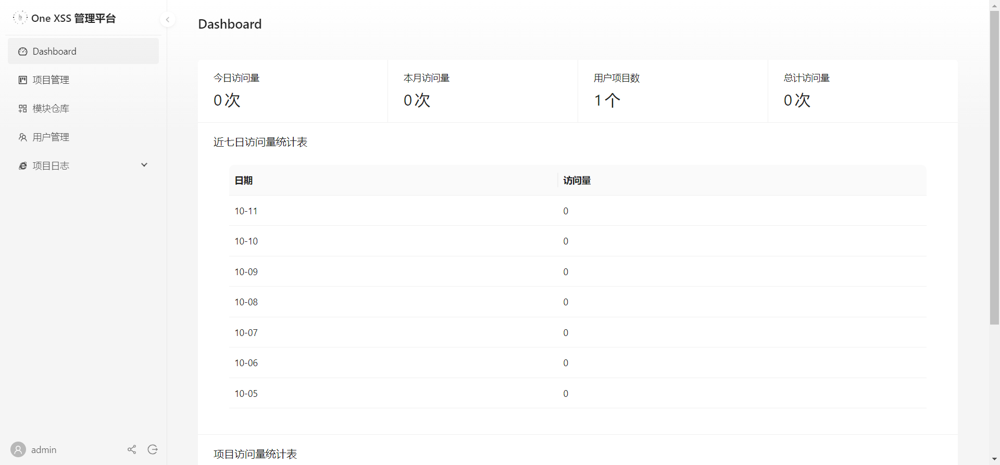
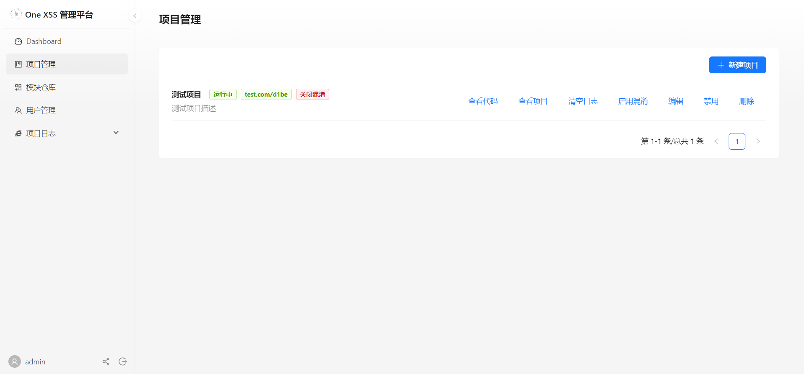
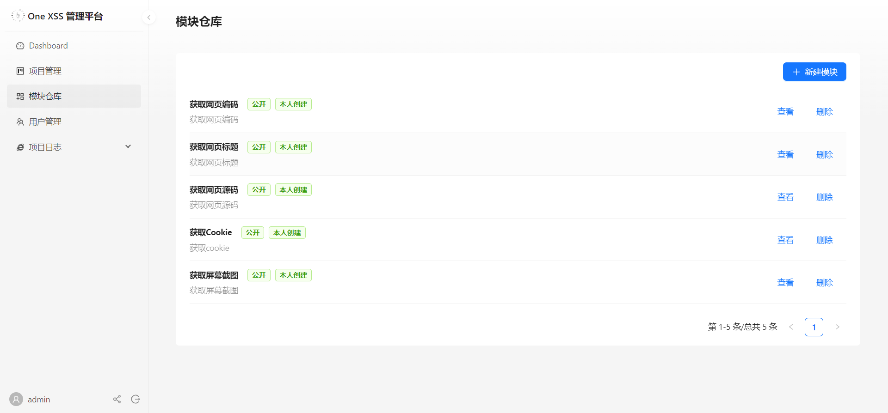
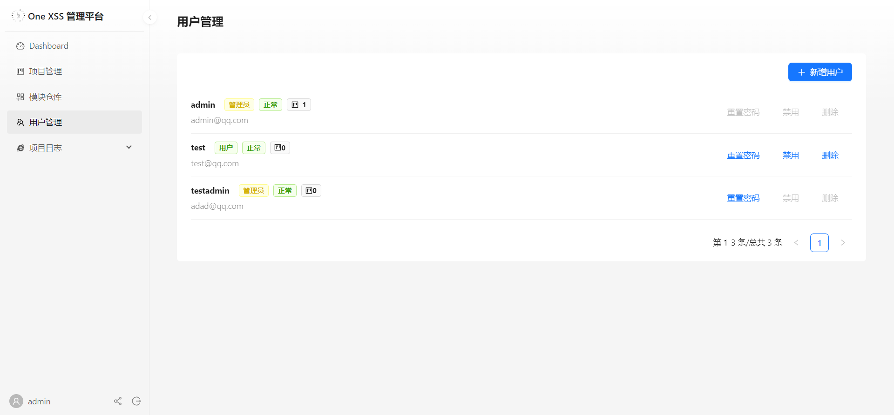
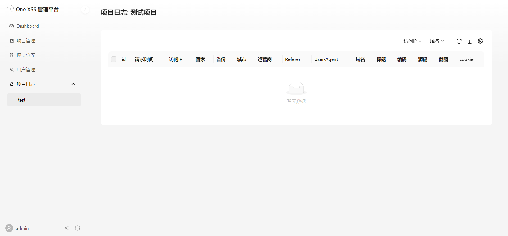

# One XSS 

- One XSS 是一款基于Cloudflare Pages/D1/KV实现的在线XSS平台,可自定义模块和项目,用于帮助渗透测试工程师进行XSS漏洞验证.
- One XSS 项目前端/后端/数据库均使用Cloudflare相关产品,采用无服务部署

> 免责声明：此项目仅限于安全研究，用户承担因使用此工具而导致的所有法律和相关责任！作者不承担任何法律责任！
>
> 为避免本项目被滥用，不提供任何测试、Demo环境。

## 一、主要功能

1. 支持按URL区分XSS不同的项目
2. 支持用户自定义XSS模块
3. 支持项目Telegram提醒
4. 支持XSS Javascript代码混淆
5. 支持XSS日志根据项目所用模块,展示不同数据
6. 实现基本的用户管理
7. 实现用户邀请码注册功能

---

## 二、技术栈

- node.js
- Ant Design / Ant Design Pro 
- next.js
- Cloudflare Pages
- Cloudflare Workers
- Cloudflare D1 无服务器 SQL 数据库
- Cloudflare KV 键值对

---

## 三、安装部署

- [查看部署说明Wiki](https://github.com/onxss/OneXSS/wiki/%E9%83%A8%E7%BD%B2%E8%AF%B4%E6%98%8E)

---

## 四、使用指南

- [查看使用指南Wiki](https://github.com/onxss/OneXSS/wiki/%E4%BD%BF%E7%94%A8%E6%8C%87%E5%8D%97)

---

## 五、运行截图

- Dashboard

  

- 项目管理

- 模块仓库

  

- 用户管理

  

- 项目日志

  

---

## 六、Cloudflare 平台限制

- `One XSS` 项目，将用户信息、模块信息、项目信息、日志信息等保存在D1数据库中。
- `One XSS` 项目，将登陆Token、项目代码等缓存在KV中。
- 因此将受到Cloudflare的部分限制。

### 1. D1数据库限制

- [D1数据库限制详情](https://developers.cloudflare.com/d1/platform/limits/)
- 对于个人用户，500MB的免费存储空间足够用于渗透测试使用。

| 类别                                                         | 限制                                     |
| :----------------------------------------------------------- | :--------------------------------------- |
| 数据库数量                                                   | 50,000 (付费用户) beta / 10 (免费用户)   |
| 最大数据库大小                                               | 2 GB (付费用户) beta / 500 MB (免费用户) |
| 每个帐户的最大存储空间                                       | 50 GB (付费用户) beta / 5 GB (免费用户)  |
| [Time Travel](https://developers.cloudflare.com/d1/learning/time-travel/) 间隔时间 (时间点恢复) | 30 days (付费用户) / 7 days (免费用户)   |
| 最大 Time Travel 还原操作数                                  | 每 10 分钟 10 次还原（每个数据库）       |
| 每个工作线程调用的查询数（读取子请求限制）                   | 50 (**Bundled**) / 1000 (Unbound)        |
| 每个表的最大列数                                             | 100                                      |
| 每个表的最大行数                                             | 无限制（不包括每个数据库的存储限制）     |
| 最大字符串或 `BLOB` 表行大小                                 | 1,000,000 bytes (1 MB)                   |
| 最大 SQL 语句长度                                            | 100,000 bytes (100 KB)                   |
| 每个查询的最大绑定参数数                                     | 100                                      |
| 每个 SQL 函数的最大参数数                                    | 32                                       |
| `LIKE` 或 `GLOB` 模式中的最大字符数（字节）                  | 50 bytes                                 |
| 每个工作线程脚本的最大绑定数                                 | 约5,000 人                               |

### 2. KV限制

- [KV键值限制详情](https://developers.cloudflare.com/kv/platform/limits/)
- KV仅在One XSS中用于缓存，因此写操作1000次可满足个人渗透测试使用。
- 一般情况下，每天10万次读可满足个人渗透测试使用。

| 类别            | 免费用户            | 付费用户   |
| :-------------- | :------------------ | :--------- |
| 读              | 每天 100,000 次读取 | 无限       |
| 写入不同的键    | 每天 1,000 次写入   | 无限       |
| 写入同一密钥    | 每秒 1 次           | 每秒 1 次  |
| 操作/worker调用 | 1000                | 1000       |
| 命名空间        | 100                 | 100        |
| 存储/帐户       | 1 GB                | 无限       |
| 存储/命名空间   | 1 GB                | 无限       |
| 键/命名空间     | 无限                | 无限       |
| 键大小          | 512 bytes           | 512 bytes  |
| 键元数据        | 1024 bytes          | 1024 bytes |
| 值大小          | 25 MiB              | 25 MiB     |

### 3. Workers限制

- [Workers限制详情](https://developers.cloudflare.com/workers/platform/limits/)

- 在编写该项目代码时，考虑了部分Workers的限制，特别是CPU处理时间和压缩后大小问题，因此管理端无法做的花里胡哨，也因此管理端的功能无法做的非常丰富。

- 目前项目编译压缩后大小约为600~700KB，经测试不高于950KB均可部署成功。

- **受制于500MB的D1数据库大小，因此预计One XSS项目在使用中受到Workers限制的影响的概率较小**

- 帐户计划限制

    | 类别                   | 免费用户   | 付费用户 (Bundled 和 Unbound)                                |
    | :--------------------- | :--------- | :----------------------------------------------------------- |
    | 子请求                 | 50/request | 50/request ([Bundled](https://developers.cloudflare.com/workers/platform/pricing/#bundled-usage-model)), 1000/request ([Unbound](https://developers.cloudflare.com/workers/platform/pricing/#unbound-usage-model), [Standard](https://developers.cloudflare.com/workers/platform/pricing/#standard-usage-model)) |
    | 同时传出连接           | 6          | 6                                                            |
    | 环境变量数             | 64/Worker  | 128/Worker                                                   |
    | 环境变量大小           | 5 KB       | 5 KB                                                         |
    | Worker 压缩后大小      | 1 MB       | 10 MB                                                        |
    | Worker 启动时间        | 400 ms     | 400 ms                                                       |
    | Worker 数量            | 100        | 500                                                          |
    | 每个Worker的触发器数量 | 3          | 3                                                            |
    | 每个账户的触发器数量   | 5          | 250                                                          |
    
- Worker限制

    | 类别          | 免费用户                            | Bundled Usage Model                         | Unbound Usage Model                                          |      |
    | :------------ | :---------------------------------- | :------------------------------------------ | :----------------------------------------------------------- | :--- |
    | 请求          | 100,000 个请求/天  1000 个请求/分钟 | 无限                                        | 无限                                                         |      |
    | 工作线程内存  | 128 MB                              | 128 MB                                      | 128 MB                                                       |      |
    | CPU处理时间   | 10 ms                               | 50 ms HTTP request  50 ms Cron Trigger | 30 s HTTP request  15 min Cron Trigger  15 min Queue Consumer |      |
    | Duration 期间 | 无限                                | 无限                                        | 无限                                                         |      |

---

## 七、免责声明

本工具仅面向**合法授权**的企业安全建设行为，如您需要测试本工具的可用性，请自行搭建测试环境。

为避免被恶意使用，本项目所有收录的模块均为对浏览器的理论判断，不存在漏洞利用过程，不会对目标发起真实攻击和漏洞利用。

在使用本工具进行检测时，您应确保该行为符合当地的法律法规，并且已经取得了足够的授权。**请勿对非授权目标进行扫描。**

如您在使用本工具的过程中存在任何非法行为，您需自行承担相应后果，我们将不承担任何法律及连带责任。

在安装并使用本工具前，请您**务必审慎阅读、充分理解各条款内容**，限制、免责条款或者其他涉及您重大权益的条款可能会以加粗、加下划线等形式提示您重点注意。 除非您已充分阅读、完全理解并接受本协议所有条款，否则，请您不要安装并使用本工具。您的使用行为或者您以其他任何明示或者默示方式表示接受本协议的，即视为您已阅读并同意本协议的约束。
